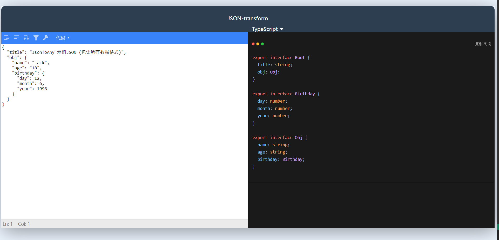

## 💡 介绍

⚡️JsonToAny是一款前端开发人员的在线代码生成工具，通过开发者给定的 `JSON` / `Object`，自动生成指定的代码，提高团队前期整体开发效率。


## ✨ 功能

> 目前支持如下语言转换
* TypeScript（Web前端开发人员）


## 📝 使用

在线地址：[https://monody517.github.io/json-transform-web/](https://monody517.github.io/json-transform-web/)

当然，你也可以 `Fork` 该项目对代码的生成结果进行定制化开发，自由操控生成结果。

## 🎉 效果

> JSON 转 TypeScript


## 🔨 开发

```bash
# github
git clone https://github.com/monody517/json-transform.git
# 安装依赖（推荐pnpm）
yarn
# 启动服务
npm run dev
```